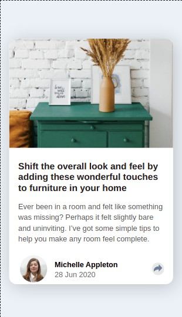
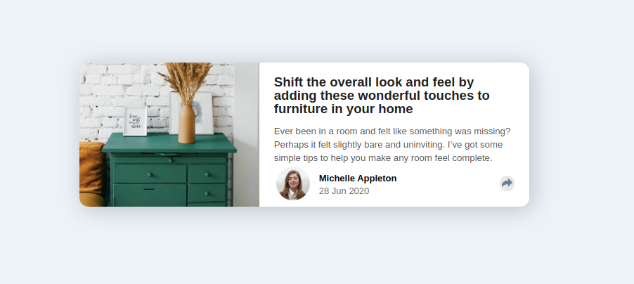

# Frontend Mentor - Article preview component solution

This is a solution to the [Article preview component challenge on Frontend Mentor](https://www.frontendmentor.io/challenges/article-preview-component-dYBN_pYFT). Frontend Mentor challenges help you improve your coding skills by building realistic projects. 

## Table of contents

- [Overview](#overview)
  - [The challenge](#the-challenge)
  - [Screenshot](#screenshot)
  - [Links](#links)
- [My process](#my-process)
  - [Built with](#built-with)
  - [Useful resources](#useful-resources)
- [Author](#author)
- [Acknowledgments](#acknowledgments)

**Note: Delete this note and update the table of contents based on what sections you keep.**

## Overview

### The challenge

Users should be able to:

- View the optimal layout for the component depending on their device's screen size
- See the social media share links when they click the share icon

### Screenshot
Mobile View

Desktop View

### Links

- Solution URL: [Solution URL](https://www.frontendmentor.io/solutions/article-preview-card-using-html-css-and-jsmobile-first-approach-VHvWYreQi)
- Live Site URL: [Site URL](https://jshiwam.github.io/article-preview-component-master/)

## My process

### Built with

- Semantic HTML5 markup
- CSS custom properties
- Flexbox
- CSS Grid
- Mobile-first workflow

### Useful resources

- [Media Queries in JS](https://www.w3schools.com/howto/howto_js_media_queries.asp) 

## Author

- Website - [Shiwam Jaiswal](https://www.shiwam.me)
- Frontend Mentor - [@jshiwam](https://www.frontendmentor.io/profile/jshiwam)

## Acknowledgments

Completed by self with the help of stackoverflow and w3schools references.
